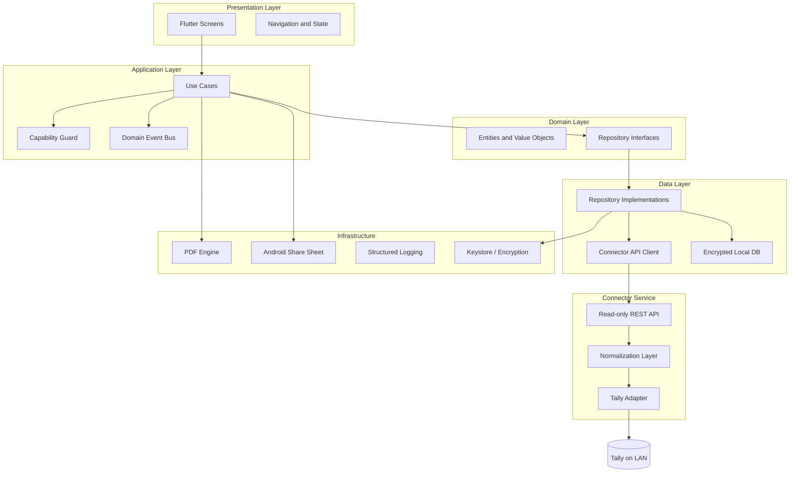

# Architecture Overview

Venture follows clean architecture with strict module boundaries aligned to the MVP 1 specification (Section 18).

## Layered model

## Data flow (read path)

1. User action triggers a **use case** in the application layer.
2. Use case validates **capabilities** before proceeding.
3. Repository checks local cache freshness; fetches from connector if needed.
4. Connector **Tally adapter** reads Tally via export/XML/HTTP (implementation in Milestone 1).
5. **Normalization layer** maps Tally output to stable Venture entities.
6. Repository persists normalized data locally and returns domain models.
7. UI renders from domain models; **freshness timestamp** is always visible.
8. Use case publishes a **domain event** (e.g. `LedgerViewed`).

## Connection states

| State | Meaning |
|-------|---------|
| Live | Connected and current |
| Refreshing | Fetch in progress |
| Cached | Last sync available offline |
| Stale | Cache older than threshold |
| Error | Cannot connect or validate |
| Unpaired | Setup required |

## Security boundaries

- Connector exposes **read-only** REST endpoints on the local network
- Device **pairing** is the only permitted mutating HTTP route in MVP 1
- Secrets stored in platform keystore; never logged
- Export files use app-controlled cache URIs

## Schema versioning

- API responses include `schemaVersion` (currently `1.0.0`)
- Local database maintains independent `schema_version` with transactional migrations
- Connector compatibility checked on connect and upgrade
