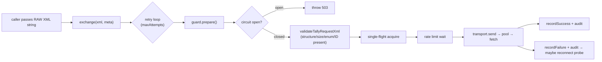
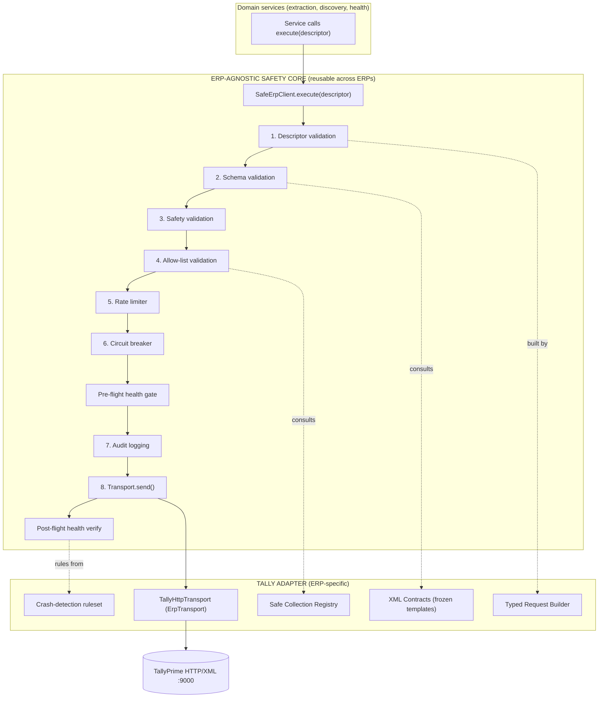
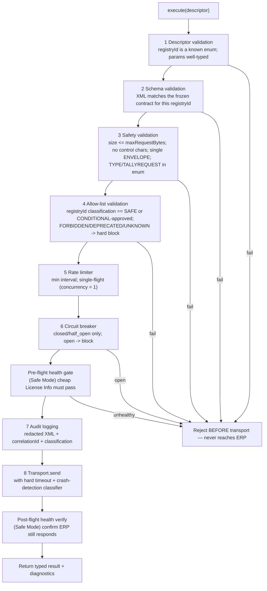
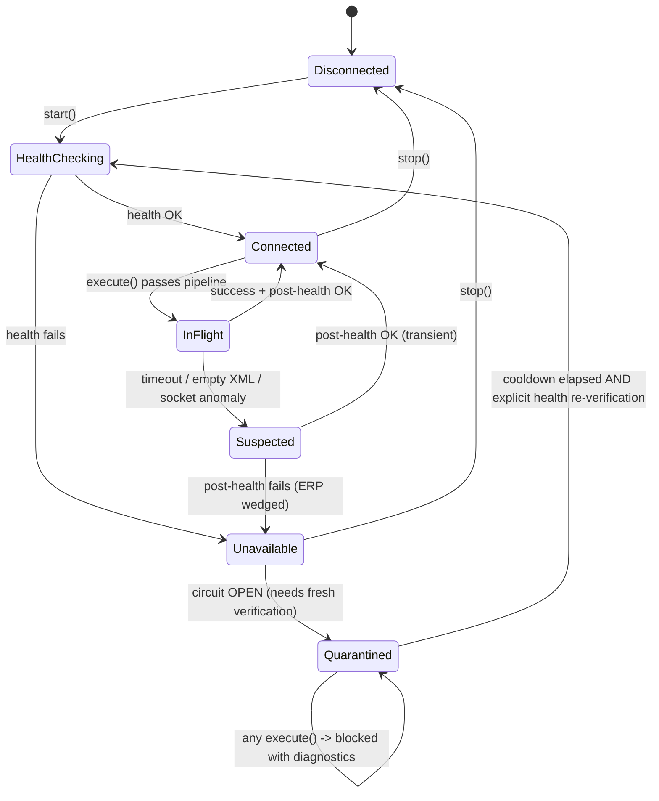
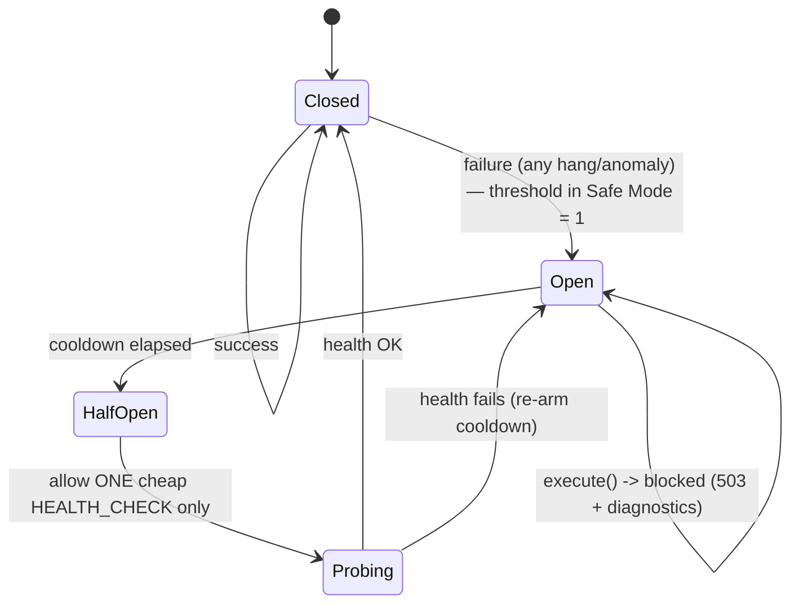
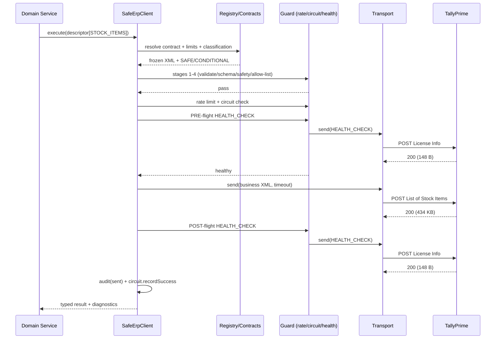
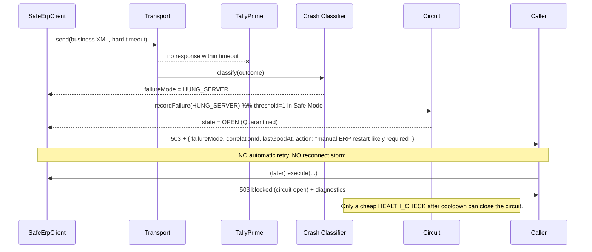

# Venture Connector — ERP Communication Safety Architecture

**Status:** Architecture review (design only — no business logic changed, not committed)
**Date:** 2026-07-22
**Scope:** The Tally/ERP communication layer only. No extraction, sync, licensing, or Flutter work.
**Prime directive:** An unsafe request must be **structurally impossible** to send to the ERP — even if a future developer makes a mistake. Treat the ERP as a fragile external system (industrial PLC / banking core): one invalid request is unacceptable.

This review is grounded in the proven root cause from `docs/diagnostics/TALLY_HANG_ROOT_CAUSE_INVESTIGATION.md`:

> A single well-formed `Export`/`Collection` request with an **unresolvable ID** (e.g. `List of Units`, or any unknown ID) deadlocks TallyPrime's HTTP handler. The process stays alive; CPU and memory stay flat; the socket dies until a manual restart. **Client-side timeouts do not save Tally** — the damage is done the moment the request is accepted. Therefore the only effective control is **prevention: never emit a request that is not proven safe.**

---

## 1. Current Architecture (as-is)

### 1.1 Module map (existing code)

```
src/tally/
├── core/
│   ├── erp-transport.interface.ts   # ErpTransport { send, close }   ← already ERP-agnostic
│   └── types.ts                     # ErpTransportRequest/Response, state, diagnostics
├── xml/
│   ├── request-builder.ts           # TallyXmlRequestBuilder.build(spec) → string
│   └── response-parser.ts
├── safety/
│   ├── xml-request-validator.ts     # structure/size/control-char/enum checks
│   ├── tally-request-guard.ts       # circuit + single-flight + rate limit + audit
│   ├── tally-circuit-breaker.ts     # closed/open/half_open
│   └── tally-request-auditor.ts     # redacted JSONL audit
├── connection/
│   ├── tally-connection-manager.ts  # exchange(xml, meta): retry loop + reconnect
│   ├── reconnect-manager.ts
│   └── retry-policy.ts
└── transport/
    ├── tally-http-transport.ts      # fetch + AbortController timeout
    └── connection-pool.ts           # semaphore
```

### 1.2 Current request path (`TallyConnectionManager.exchange`)



### 1.3 What already exists and is good

- `ErpTransport` interface **already abstracts transport** (good foundation for multi-ERP).
- Circuit breaker, single-flight (concurrency = 1), rate limiter, redacted audit trail, correlation IDs — all present.
- Safe-mode runtime limits (`resolveTallyRuntimeLimits`) force pool = 1, retry = 1, auto-reconnect off.

### 1.4 Proven, critical gaps (why Tally can still be crashed today)

| # | Gap | Consequence | Evidence |
|---|-----|-------------|----------|
| **G1** | **No allow-list.** `validateTallyRequestXml` only checks that an `<ID>` *exists*, not that it is *approved*. | `List of Units` and any unknown ID pass validation and reach Tally → hang. | Investigation E1/E3 |
| **G2** | **Raw XML is the public API.** `exchange(xml: string)` accepts any string. Nothing forces use of the builder. | A future dev can hand-craft any request. | `tally-connection-manager.ts:117` |
| **G3** | **No Safe Collection Registry.** Collection IDs are string literals scattered across `master-data-templates.ts` / `extractor-registry.ts`. | No single source of truth for what is safe; no risk/timeout/payload metadata. | `master-data-templates.ts:4-17` |
| **G4** | **Templates are mutable & ad-hoc.** `buildCollectionTemplate` builds anything; devs add template fns inline. | No contract; regressions reintroduce dangerous IDs silently. | `master-data-templates.ts:27-66` |
| **G5** | **Timeout treated as protection.** Fail-fast timeouts (30/90s) bound the *client*, not Tally. | Tally still wedges; timeout only hides it. | Investigation E4 |
| **G6** | **Failure modes collapsed into 503/504.** Transport cannot distinguish hung-server vs empty-XML vs half-open socket. | Recovery cannot react correctly; a wedged Tally looks like a transient error. | `tally-http-transport.ts:97-114` |
| **G7** | **Retry/reconnect machinery still in the hot path.** `exchange` loops and probes. | Any retry against a fragile ERP is a second chance to do harm. | `tally-connection-manager.ts:132-211` |
| **G8** | **No mandatory pre/post health check per request.** Health probe only runs during reconnect. | We send business requests without confirming Tally is healthy first, and never confirm it survived. | `tally-connection-manager.ts:256` |
| **G9** | **Circuit is in-memory & auto-reopens.** `half_open` after cooldown sends a *real* request. | A wedged Tally (needs manual restart) gets hit again after 60 s. | `tally-circuit-breaker.ts:16-23` |

---

## 2. Design Principles → Architecture Decisions

| Principle (mission) | Decision |
|---------------------|----------|
| 1. Connector protects the ERP | Prevention-first: unsafe requests cannot be *constructed*, let alone sent. |
| 2. No raw XML | The only public entry point takes a **typed request descriptor** bound to the registry. Raw-string send is removed from the public surface. |
| 3. Fixed pipeline, no bypass | One choke point (`SafeErpClient.execute`) runs all stages in order. There is no other path to the transport. |
| 4. Safe Collection Registry | A single immutable registry is the source of truth; unregistered requests are impossible. |
| 5. XML Contracts | Each registry entry owns a **frozen** template + golden request/response snapshot enforced by tests. |
| 6. Safe Mode | Single-flight, sequential, mandatory delay, pre/post health checks, hard stop on any anomaly. |
| 7. Crash detection | Transport classifies outcomes into distinct failure modes. |
| 8. Recovery, not retry | No automatic retries. Mark ERP unavailable → open circuit → return diagnostics → require fresh health verification. |
| 9. Regression tests | A permanent "dangerous XML" suite that must always be blocked. |
| 10. Documentation | This document. |
| 11. Classify every request | SAFE / CONDITIONAL / DEPRECATED / FORBIDDEN / UNKNOWN; UNKNOWN never executes. |
| 12. Future ERP support | Safety pipeline is ERP-agnostic; Tally specifics live only in the Tally adapter. |

---

## 3. Target Architecture

### 3.1 Layered diagram (ERP-agnostic core + ERP adapter)



**Key inversion vs today:** the safety pipeline moves *above* the transport and *below* the services, and it is ERP-agnostic. The Tally adapter contributes only data (registry, contracts, crash rules) and the concrete transport. To add SAP/QuickBooks/etc. later, implement a new adapter — the pipeline is untouched.

### 3.2 The single choke point (how "no bypass" is enforced)

```ts
// PROPOSED — ERP-agnostic core
export interface ErpRequestDescriptor {
  readonly registryId: RegisteredRequestId;   // enum — cannot be an arbitrary string
  readonly renderedXml: string;                // produced ONLY by the registry-bound builder
  readonly classification: RequestClassification;
  readonly limits: RequestLimits;              // maxResponseBytes, timeoutMs, retry policy
}

export interface SafeErpClient {
  execute(descriptor: ErpRequestDescriptor): Promise<ErpExchangeResult>;
  // NOTE: there is deliberately NO execute(xml: string) overload.
}
```

- `renderedXml` is not caller-supplied: descriptors are produced only by `RegistryBoundRequestBuilder.build(RegisteredRequestId, params)`.
- `RegisteredRequestId` is a TypeScript enum/union. A developer literally cannot name a request that is not in the registry — it is a compile error.
- Defense in depth: stage 4 (allow-list) re-checks `descriptor.registryId ∈ registry` at runtime, so even reflection/`any` casts are caught before transport.
- The legacy `exchange(xml, meta)` becomes `private` and is used only internally by the health probe (a hard-coded, registry-owned `HEALTH_CHECK` descriptor).

---

## 4. Safety Pipeline (fixed order, no bypass)



Each stage can only **reject** (fail closed) or pass to the next. There is no stage that can skip a later stage. Rejections at stages 1–7 and the pre-flight gate mean **the request never touches the ERP**.

---

## 5. XML Contracts

Every registered request owns an immutable contract:

```ts
// PROPOSED
export interface XmlContract {
  readonly registryId: RegisteredRequestId;
  readonly render: (params: Readonly<ContractParams>) => string; // pure, deterministic
  readonly goldenRequestSnapshot: string;   // exact expected XML (params redacted)
  readonly exampleResponseShape: string;     // representative response for parser tests
}
```

Rules enforced by tests (Section 10):

1. `render()` output for fixed params must byte-match `goldenRequestSnapshot`. Any inline edit to a template fails CI.
2. A contract may only be added with a classification, a live-evidence reference, and a test.
3. Contracts are frozen (`Object.freeze`) and exported read-only; no runtime mutation.
4. Developers **cannot** build XML by string concatenation in services — lint rule + the fact that the transport only accepts descriptors.

---

## 6. Safe Collection Registry

Source of truth for every request the connector may send. Anything not listed is **UNKNOWN → blocked**.

| Registry ID | Type | Purpose | Class | Risk | Max payload | Timeout | Retry | Evidence | Tests |
|-------------|------|---------|-------|------|-------------|---------|-------|----------|-------|
| `HEALTH_CHECK` | Data / `License Info` | Connectivity probe | SAFE | LOW | 4 KB | 10 s | none | Live OK 148 B / 410 ms | contract+unit |
| `COMPANY_LIST` | Collection / `List of Companies` | Company discovery | SAFE | LOW | 64 KB | 15 s | none | Live OK 2,185 B / 10 ms | contract+integration |
| `COMPANY_INFO` | Object / `Company` | Company metadata | CONDITIONAL | MED | 64 KB | 20 s | none | Audit `sent`; has discovery fallback | contract+integration |
| `LEDGER_GROUPS` | Collection / `List of Groups` | Ledger groups | SAFE | LOW | 128 KB | 20 s | none | Live 28 rec | contract+integration |
| `LEDGERS` | Collection / `List of Ledgers` | Ledgers | CONDITIONAL | MED | 512 KB | 30 s | none | Live 921 rec / 260 KB / 134 ms | contract+integration |
| `STOCK_GROUPS` | Collection / `List of Stock Groups` | Stock groups | SAFE | LOW | 128 KB | 20 s | none | Live 58 rec | contract+integration |
| `STOCK_CATEGORIES` | Collection / `List of Stock Categories` | Stock categories | SAFE | LOW | 64 KB | 20 s | none | Live 0 rec (fast-empty) | contract+integration |
| `STOCK_ITEMS` | Collection / `List of Stock Items` | Stock items | CONDITIONAL | MED | 1 MB | 45 s | none | Live 1,502 rec / 434 KB / 221 ms | contract+integration |
| `GODOWNS` | Collection / `List of Godowns` | Godowns | SAFE | LOW | 64 KB | 20 s | none | Live 1 rec | contract+integration |
| `COST_CATEGORIES` | Collection / `List of Cost Categories` | Cost categories | SAFE | LOW | 64 KB | 20 s | none | Live 1 rec | contract+integration |
| `COST_CENTRES` | Collection / `List of Cost Centres` | Cost centres | SAFE | LOW | 64 KB | 20 s | none | Live 0 rec | contract+integration |
| `VOUCHER_TYPES` | Collection / `List of Voucher Types` | Voucher types | SAFE | LOW | 64 KB | 20 s | none | Live 24 rec | contract+integration |
| `GST_REGISTRATIONS` | Collection / `List of GST Registrations` | GST registrations | SAFE | LOW | 64 KB | 20 s | none | Live 0 rec | contract+integration |

**Retry policy is `none` for every entry** — see Section 9 (recovery, not retry). Timeouts bound the client only; they are a secondary control, not the primary safety mechanism.

### 6.1 Classification legend

| Class | Meaning | May execute? |
|-------|---------|--------------|
| SAFE | Live-verified fast return, bounded payload | Yes |
| CONDITIONAL | Live-verified but large / data-dependent / has fallback | Yes, with strict payload cap + longer timeout + explicit opt-in flag |
| DEPRECATED | Previously used, now superseded; retained only to block reintroduction | No |
| FORBIDDEN | Proven to hang/crash the ERP | Never |
| UNKNOWN | Not in the registry | Never (default-deny) |

---

## 7. Forbidden Collection Registry

Permanent block-list. Attempting to register or send any of these must fail at build/test time and at runtime.

| Forbidden request | Type | Why forbidden | Evidence |
|-------------------|------|---------------|----------|
| `List of Units` | Collection | Unresolvable ID in this build → HTTP handler deadlock | Investigation E1 (audit timeouts 120 s / 30 s), prior sessions |
| `Stock Item` (single-object export via `SVSTOCKITEMNAME`) | Object | Object export form hangs the handler | Investigation E6 (30 s timeout, Tally dead after) |
| Any unresolvable / non-registry ID (e.g. `Company Features`, `List of Zzz Nonexistent`) | Collection | Unknown IDs deadlock rather than error | Investigation E3 (control experiment) |

Units data is obtained by **deriving from stock items** (`deriveUnitsFromStockItems`) — not by calling `List of Units`. Real per-item unit values require an enriched stock-item export or a TDL-defined `Unit` collection that must be **proven safe on a disposable Tally instance before it may be registered**.

---

## 8. Connection State Machine



- `Suspected` is new: a single anomaly does not immediately fail the whole ERP, but it **forces a post-flight health verification** before anything else runs.
- `Quarantined` maps to circuit **open**: no business request may run; callers get diagnostics, not a queued retry.
- The only way out of `Quarantined` is a successful **cheap health check** — never a business request (fixes G9).

---

## 9. Circuit Breaker Lifecycle (recovery, not retry)



Differences from current implementation:

- **In Safe Mode the failure threshold is 1** — a single hang quarantines the ERP immediately. (Today it is 2.)
- **`HalfOpen` probes with `HEALTH_CHECK` only**, never a real business request (today `half_open` lets the next real request through — fixes G9).
- **No retry loop** in `execute`. `RetryPolicy`/`ReconnectManager` are removed from the request hot path (fixes G7). A failed request returns immediately with a typed failure + diagnostics.

---

## 10. Communication Sequence (happy path, Safe Mode)



Pre- and post-flight health checks are cheap (`License Info`, ~150 B) and enforce principle 6: we confirm the ERP is alive **before** every business request and confirm it **survived** afterward. If the post-flight check fails, the ERP is quarantined even though the business request "returned".

---

## 11. Recovery Sequence (no retries)



---

## 12. Crash Detection — failure-mode taxonomy

The transport currently collapses everything into 503/504 (G6). Proposed distinct modes:

| Failure mode | Signal | Interpretation | Circuit action |
|--------------|--------|----------------|----------------|
| `CONNECTION_REFUSED` | `ECONNREFUSED` | ERP process/HTTP not up | Open, mark Unavailable |
| `CONNECTION_TIMEOUT` | connect phase abort | Network / ERP not accepting | Open |
| `REQUEST_TIMEOUT` | AbortController after send | **Likely hung handler** (our root cause) | Open immediately (threshold 1) |
| `HALF_OPEN_SOCKET` | `ECONNRESET` / socket closed mid-body | ERP dropped connection | Open, post-health verify |
| `EMPTY_RESPONSE` | 200 but blank body | ERP accepted but produced nothing | Suspected → post-health |
| `UNEXPECTED_XML` | body not a parseable `<ENVELOPE>` / error envelope | ERP returned an error or garbage | Suspected; do not parse as data |
| `HTTP_ERROR` | non-2xx | ERP-level rejection | Open if 5xx |
| `PROCESS_ALIVE_NO_RESPONSE` | health check fails but OS process exists | **Wedged (our exact signature)** | Quarantine; require manual restart |

`PROCESS_ALIVE_NO_RESPONSE` is detectable in the Safe-Mode post-flight step: if the post-flight `HEALTH_CHECK` times out while the ERP process is still running, we have reproduced the investigation's signature and must quarantine hard.

---

## 13. Safe Mode specification

When `VENTURE_TALLY_SAFE_MODE=true` (default):

| Control | Behaviour |
|---------|-----------|
| Concurrency | 1 (single-flight; queue serialized) |
| Execution | Strictly sequential |
| Mandatory delay | `>= 2000 ms` between requests |
| Timeout | Per-registry hard timeout (client bound) |
| Cancellation | AbortController on timeout |
| Pre-flight health | `HEALTH_CHECK` must pass before each business request |
| Post-flight health | `HEALTH_CHECK` must pass after each business request |
| Circuit threshold | 1 failure → open |
| Retries | None |
| On any anomaly | Stop immediately; quarantine; never auto-continue |

---

## 14. Future ERP abstraction

- **Reusable core (ERP-agnostic):** `SafeErpClient`, the 8-stage pipeline, rate limiter, circuit breaker, auditor, health-gate, crash classifier *interface*, descriptor/contract/registry *interfaces*.
- **Per-ERP adapter provides:** the concrete `ErpTransport`, the `Registry` entries, the `XmlContract`s (or JSON/SOAP contracts for other ERPs), and the crash-detection ruleset (which signals mean "wedged" for that ERP).
- **Naming:** rename Tally-specific core types to ERP-neutral (`SafeErpClient`, `ErpRequestGuard`, `ErpCircuitBreaker`); keep `TallyHttpTransport`, `TallyRegistry`, `TallyXmlContracts` in `src/erp/adapters/tally/`.
- Proposed target layout:

```
src/erp/
├── core/           # ERP-agnostic: client, pipeline, guard, circuit, auditor, health, crash-classifier iface
├── contracts/      # descriptor, contract, registry, classification types
└── adapters/
    └── tally/      # TallyHttpTransport, TallyRegistry, TallyXmlContracts, tally crash rules
```

---

## 15. Regression Strategy

A permanent suite that must always stay green; no release may weaken it.

1. **Forbidden-request suite** (`test/regression/forbidden-requests.test.ts`)
   - Asserts `List of Units`, single-object `Stock Item` export, and representative unknown IDs are **impossible to build** (no `RegisteredRequestId` for them) and are **runtime-blocked** by the allow-list stage.
   - Asserts the pipeline blocks them **before** `transport.send` is invoked (assert transport spy not called).
2. **Contract golden-snapshot tests** — each `XmlContract.render()` byte-matches its `goldenRequestSnapshot`; inline edits fail CI.
3. **Allow-list default-deny test** — a fabricated UNKNOWN descriptor is rejected at stage 4.
4. **Pipeline order test** — a spy harness asserts stages run in the exact order and that a stage-4 rejection prevents stages 5–8.
5. **Crash-classifier tests** — each failure mode maps to the correct circuit action; `REQUEST_TIMEOUT` opens the circuit at threshold 1 in Safe Mode.
6. **Health-gate tests** — a failing pre-flight blocks the business request; a failing post-flight quarantines even after a "successful" business response.
7. **No-retry test** — a single failure produces exactly one `transport.send` (plus health probes), never N attempts.

These extend the existing 103-test suite (`units-derivation`, `controlled-validation`, `tally-safety`, `master-data`) rather than replacing it.

---

## 16. Production Readiness Review

| Capability | Today | After proposed design |
|------------|-------|-----------------------|
| Unsafe request cannot reach ERP | ❌ (no allow-list) | ✅ default-deny registry + typed descriptors |
| Raw XML forbidden | ❌ | ✅ no public string API |
| Central registry with risk/limits | ❌ | ✅ |
| Immutable XML contracts + tests | ❌ | ✅ golden snapshots |
| Pre/post health checks | ❌ | ✅ Safe Mode |
| Distinct failure modes | ❌ | ✅ taxonomy + classifier |
| Recovery without retries | ⚠️ partial (safe-mode retry=1) | ✅ retries removed from hot path |
| Circuit probes with health only | ❌ (half-open sends real req) | ✅ |
| ERP-agnostic transport | ✅ interface exists | ✅ full core/adapter split |
| Regression lock on dangerous XML | ❌ | ✅ permanent suite |
| Unattended-for-years safety | ❌ | ⚠️ strong, with residual debt (Section 17) |

**Verdict:** Not production-ready today. With the proposed registry + typed-descriptor choke point + health-gated Safe Mode + no-retry recovery, it becomes suitable for unattended operation, subject to the residual weaknesses below.

---

## 17. Remaining Architectural Weaknesses (honest technical debt)

Nothing here is hidden; each is a real limitation of the proposed design.

1. **Allow-list is empirical, not authoritative.** Our SAFE/FORBIDDEN classification is derived from live tests against **one** company (ESTIMATION) on **one** TallyPrime build. A different company or Tally version could make a currently-SAFE collection hang, or vice-versa. *Mitigation:* per-environment re-verification harness; treat the registry as environment-scoped, not universal.
2. **Pre/post health checks add load and latency.** Two extra `License Info` round-trips per business request roughly triple request count and add mandatory delays. For large sync jobs this is slow. *Trade-off accepted* for safety; may need a "trusted burst" mode later (itself a risk).
3. **A health check passing does not guarantee the next business request is safe.** Tally can be healthy at pre-flight and still wedge on the business request. Health-gating narrows the window; it cannot eliminate it. The true guarantee comes from the **allow-list**, not the health check.
4. **We cannot prove the ERP won't hang on a *registered* request under new data.** `STOCK_ITEMS` is CONDITIONAL precisely because a much larger dataset might behave differently. Payload caps bound the response, not Tally's internal work.
5. **Circuit state is in-process and non-persistent.** A connector restart clears quarantine; if Tally is still wedged, the first post-restart health check will catch it, but there is a brief window. *Mitigation:* persist last-known ERP state to disk and require a passing health check on boot.
6. **TypeScript type-safety is compile-time only.** `any`/`as` casts or JS interop could fabricate a descriptor. The runtime allow-list (stage 4) is the real guard; the type system is the first line, not the last.
7. **Timeouts remain a blunt instrument.** They protect the *client*; they do not prevent ERP damage. The design de-emphasizes them but still relies on them to detect hangs.
8. **Regex-based XML validation** (`extractTagValue`) is brittle for adversarial input. Since XML is now generated only from frozen contracts, exposure is low, but the validator should move to a real XML parse for defense in depth.
9. **`COMPANY_INFO` object export is CONDITIONAL on limited evidence.** Object exports are the same *class* as the forbidden single-item `Stock Item` export; it is currently trusted only because it has a discovery fallback. It needs dedicated live re-verification or demotion.
10. **No OS-level ERP watchdog.** The connector detects "process alive but wedged" but cannot restart Tally. Truly unattended operation needs an external supervisor (out of connector scope) to restart Tally on quarantine.
11. **Multi-ERP is designed, not proven.** The core/adapter split is sound on paper; until a second adapter exists, hidden Tally assumptions may remain in the "agnostic" core.

---

## 18. Migration Plan (no business logic change; phased)

1. **Introduce registry + contracts + classification types** (`src/erp/contracts/`), seeded from Section 6 — pure additive.
2. **Wrap the existing builder** so every current template maps to a `RegisteredRequestId` + `XmlContract`; add golden snapshots.
3. **Add `SafeErpClient.execute(descriptor)`** delegating to the current guard/transport; add stage-4 allow-list.
4. **Flip services to descriptors**; make `exchange(xml)` private.
5. **Add health-gate + crash classifier + no-retry recovery**; set Safe-Mode circuit threshold = 1.
6. **Add the regression suite** (Section 15) and delete/quarantine the `List of Units` template.
7. **Rename core to ERP-neutral**; move Tally specifics under `adapters/tally/`.
8. Only after review approval, run lint/test/build and (separately) a fresh live re-verification.

---

## 19. Deliverable Checklist (mission §Final Deliverable)

| # | Requested | Section |
|---|-----------|---------|
| 1 | Architecture diagram | §3.1 |
| 2 | State machine | §8 |
| 3 | Safety pipeline | §4 |
| 4 | Communication sequence diagram | §10 |
| 5 | Recovery sequence | §11 |
| 6 | Safe Collection Registry | §6 |
| 7 | Forbidden Collection Registry | §7 |
| 8 | Regression strategy | §15 |
| 9 | Production readiness review | §16 |
| 10 | Remaining weaknesses (no hidden debt) | §17 |

---

**This is a design review only. No source files under `src/` were modified. Nothing was committed, tagged, or pushed. Awaiting approval before any implementation phase (Section 18) begins.**
